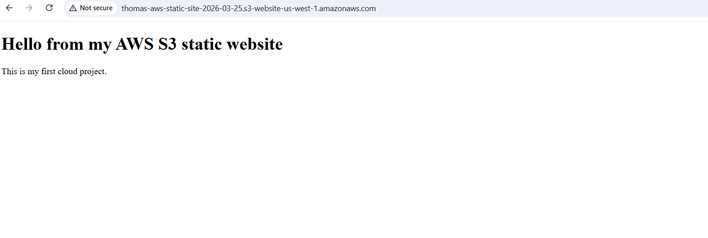

# AWS S3 Static Website

This is my first AWS cloud project where I deployed a static website using Amazon S3.

## What I built
- Created an S3 bucket
- Uploaded a static HTML page
- Enabled static website hosting
- Configured bucket policy for public access

## Live Site
http://thomas-aws-static-site-2026-03-25.s3-website-us-west-1.amazonaws.com/

## Tech Used
- AWS S3
- HTML

